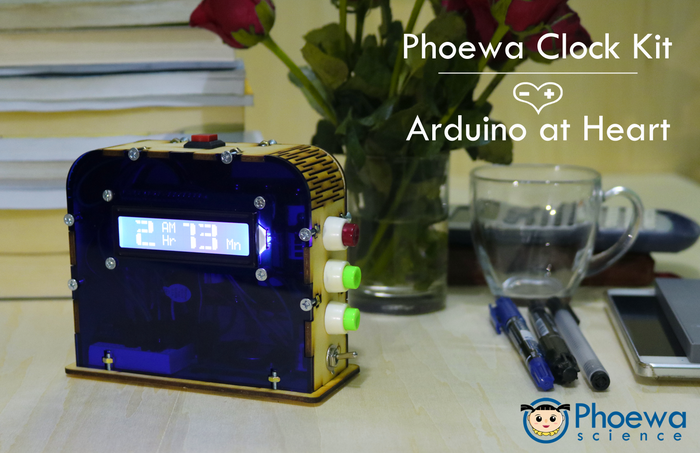

# RTC-bit-character-Arduino
Big Character Arduino Clock

## Components
* Arduino Nano
* DS1307 or DS1302 or DS3231 RTC Module
* CR2032 3V Battery
* 16x2 LCD
* I2C Module
* mini Breadboard
* push buttons and a switch
* buzzer
* AA Batteries & holder
* Some jumper wires

## Require Library
RTC Library: https://github.com/adafruit/RTClib
 
Here's a convenient website for UNIX time, you will need it:
 
Convert Time: http://www.onlineconversion.com/unix_time.htm

## Design Files
These are CorelDraw Files for Big Character Arduino Clock with LCD and RTC Module. Please use 3mm acrylic and plywood to laser cut the files.
https://www.thingiverse.com/thing:3381568
